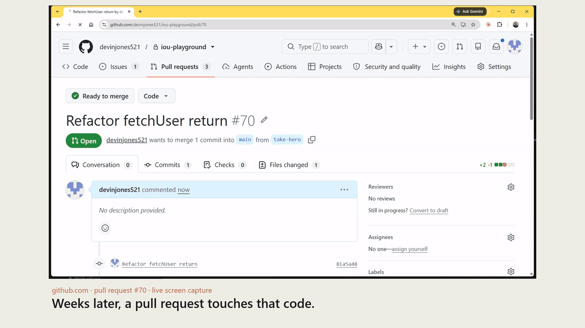

# IOU

**A GitHub bot that remembers the promises people make in pull-request threads, and speaks only
when a later PR touches that code without keeping them.**

> "I'll add retry handling in a follow-up PR."
>
> Every engineer has written that. Every reviewer has approved on the strength of it. Nobody tracks
> them. IOU does — and then stays quiet until the moment it matters.



*Live screen capture, not a mock-up. The comment arrives while the recording is running: the
service is started mid-take on a pull request it has never seen, and nobody types anything at it.
Every object in this repository's evidence is real and public —
[see the ledger](https://github.com/devinjones521/iou-playground/issues/67).*

---

## What it does

1. Someone makes a promise in a review thread on PR #41. **Nobody addresses the bot.**
2. IOU wakes on the comment, decides whether it is really a commitment to later work, and records
   it in a ledger **that lives in the repository** — an issue, so the memory is visible and
   survives a refresh.
3. Weeks later PR #58 opens. IOU reads the diff, sees it touches `fetchUser`, and checks whether
   this PR keeps the promise.
4. If it doesn't, IOU leaves **one** comment linking the original promise. If it does, or if the PR
   is unrelated, IOU says nothing at all and logs why.
5. A human reacts 👍 and IOU files a tracking issue assigned to whoever made the promise.
   **Nothing is filed without that reaction.**

## Why this can't be a chatbox

- **The trigger is not a prompt.** The interaction starts when a human writes a code review to
  another human. Nobody types anything at the bot, ever.
- **The context exists only here.** The promise is buried in a review thread nobody would paste
  into a chat window; the judgement needs the diff, the changed-file list and the repository's
  review history.
- **The output is an action in the environment.** A comment on the pull request, a reaction as the
  approval UI, an issue in the tracker — not a message about them.

## Restraint is the product

A bot that comments on every PR gets muted in a week. IOU's default is silence, and that is
enforced structurally, not by prompting:

| Situation | What IOU does |
|---|---|
| Comment isn't a promise | Nothing. Logs `not a promise` |
| Model output unparseable or low-confidence | Nothing. Fails **closed** — never invents a promise |
| PR touches no open IOU | Nothing. Deterministic pre-filter runs before any model call |
| PR touches one and doesn't keep it | **One** comment per pull request |
| PR touches one that was already filed | Nothing. An issue exists; saying it again is nagging |
| Nobody reacts | Nothing is filed |
| PR **keeps** the promise | One comment closing the loop, and the ledger entry settles. Asks nothing |

The last row is the one that makes the rest trustworthy. A bot that only ever nags gets muted; IOU
also notices when you do the thing, says so once, and marks the ledger. It tells the tracking issue
too — but it does **not** close it, because closing someone's issue is a judgement about their work,
and the bot never takes an outward action nobody asked for.

The negative fixtures are part of the live end-to-end suite, including the one that matters most
— *"I'll never do that"*, which contains every surface feature of a promise and is not one. It is
sent to the real classifier against the real API, and the evidence file records that it was not
recorded.

## Architecture

```
  human writes a review comment
            │
            ▼
   poll (no webhook, no tunnel)  ──►  classify ──► fail closed ──► silence
            │                                           │
            │                                     promise? ▼
            │                          ledger issue in the repo  ◄── the memory
            ▼
     a later PR opens
            │
            ▼
   deterministic filter: does the diff touch it?  ──► no ──► silence + log line
            │ yes
            ▼
   does the diff keep the promise?  ──► yes / can't tell ──► silence
            │ no
            ▼
   ONE comment on the PR  ──►  👍 ──► tracking issue, assigned
                           └──►  👎 ──► IOU dropped
```

**Eight GitHub operations, total.** They are declared in one frozen list in `src/github.mjs` and
the cap is enforced by a test, not by convention. A rule that isn't executed isn't a rule.

## Setup

```bash
npm install                 # one dependency: the official Anthropic SDK. Node 22+.
cp .env.example .env        # then fill in the values below
npm run verify              # the fast gate: scoreboard, tests, adapter cap
IOU_LIVE=1 npm run verify   # the same gate plus the full live end-to-end
npm run watch               # run the bot against your repo
```

`.env`:

```
ANTHROPIC_API_KEY=<a key used only for this>
IOU_APP_ID=<your GitHub App id>
IOU_INSTALLATION_ID=<the installation id>
IOU_APP_PEM=./iou-app.pem
IOU_REPO=owner/repo
IOU_BOT_LOGIN=your-app-slug[bot]
```

The App needs **Contents: read**, **Issues: write**, **Pull requests: write**. Note it cannot push
code — by design.

### The model backend

A provider chain, first configured wins:

| | When | Notes |
|---|---|---|
| **Anthropic API** | `ANTHROPIC_API_KEY` is set | The real backend. Deployable, and what you want. |
| **OpenRouter** | `OPENROUTER_API_KEY` is set | For anyone without an Anthropic account. |
| **Claude Code CLI** | neither is set | Local convenience only. Not deployable — it uses your own interactive login — and roughly 23x more expensive per call, because the CLI injects about 22,000 tokens of its own scaffolding into every request. |

Cost is small enough to state exactly. A classification is about 420 tokens in and 80 out; a diff
judgement about 1,600 in and 110 out. On Opus that is roughly $0.004 and $0.011; on Haiku, $0.0008
and $0.002. Set `IOU_MODEL` to pick.

**On identity federation.** Anthropic offers Workload Identity Federation, which removes the static
key entirely by having your cloud or CI provider issue short-lived tokens. It is the better answer
if you run IOU on GCP, AWS, Azure or GitHub Actions, and the SDK picks it up automatically once the
federation environment variables are set. It does **not** apply to a plain VPS, which has no
identity provider to federate against — Anthropic's own guidance says as much. Note that federation
removes the risk of a key being *stolen*, not the risk of it being *used*: whatever can trigger the
workload can still spend. That second risk is what the budget below is for.

## Spend control, because the triggers come from strangers

Anyone with a GitHub account can comment on a public repository, and every comment is a potential
model call. IOU has three ceilings, all failing closed, all overridable by environment variable —
but they are not all the same kind of thing, and it is worth being straight about which is which:

| Ceiling | Default | Kind | Why |
|---|---|---|---|
| Per actor, per hour | 40 | **Product** | Rate-limiting per commenter is what any bot triggered by strangers needs. Enough that someone can explore it properly; someone hammering it gets 40, then silence. |
| Per tick | 20 | **Product** | One enormous pull request, or a backlog after downtime, cannot drain the budget in a single pass. |
| Lifetime | 2000 | **Deployment guard** | Not a product feature. This is a demo running on the author's own key, so the worst case needs to be a known number of pennies rather than an open-ended bill. A real deployment would want a rolling monthly budget and an alert, not a one-way counter that silences the bot permanently and needs `.iou/budget.json` deleted to revive it. |

The first two would survive into production unchanged. The third exists because this particular bot
is pointed at a public repository with a stranger on the other end and a personal card behind it.

Three details that matter more than the numbers:

- **A failed call never consumes budget.** Spend is recorded after the model answers, not before, so
  a credit failure or a network error costs nothing.
- **A corrupt budget file reads as exhausted, not as zero spend.** The opposite would silently
  remove the ceiling, which is the failure mode worth designing against.
- **A comment denied by the budget is skipped, not marked handled.** It gets a fair look when the
  hour rolls over rather than being quietly swallowed.

This is deliberately **not** an allowlist. An allowlist would keep strangers out, and the entire
point of running IOU in the open is that someone else can open a pull request and watch it answer.

**Everything the bot posts under its own name is sanitised first** — links, HTML, `@`-mentions and
issue cross-references are defused and the text is capped. The attack this closes is real: craft a
comment that makes the classifier echo your text back, and you have content signed by the bot,
which reads as trustworthy precisely because the bot wrote it.

## Running it on a server

`deploy/` has a systemd unit and an install script.

The property that makes this safe is that **IOU listens on nothing**. It polls GitHub outbound and
has no port, no web server and no webhook endpoint, so hosting it adds no remotely reachable attack
surface. The unit runs it as a dedicated unshelled user with an empty capability set,
`ProtectSystem=strict`, and exactly one writable directory.

```bash
sudo bash deploy/install.sh     # installs, creates a 0600 placeholder env file, and stops
sudoedit /etc/iou/iou.env       # you fill in the secrets; the script never touches them
sudo systemctl enable --now iou
journalctl -u iou -f
```

To stop it spending anything ever again: `systemctl disable --now iou`, then revoke the key.

## Verification

`npm run verify` is the only oracle: one command, one exit code. It refuses to lie in ways this
project learned the hard way:

- The scoreboard step rejects any feature marked passing whose evidence file doesn't exist.
- The tests step demands a TAP pass count. Exit 0 is not proof — a runner that skipped every file
  also exits 0, and did, for the first two hours of this build.
- The live step is **loudly** held open when it hasn't run, rather than silently skipped.
- Every gate was tested against deliberately broken input before being trusted.

## Known limitations

See [`LIMITATIONS.md`](LIMITATIONS.md) — written as each shortcut was taken, not afterwards. The
short version: one repository with bounded reads inside it, the Claude Code CLI fallback is local
convenience only (not deployable, and 23x the cost per call), the judgement is a model's opinion,
five ledger comments cited by older evidence files were deleted by our own demo staging, and the
forced-5xx failure path is tested against a local server because GitHub won't return a 500 on
request.

An unexplained failure is documented in [`BLOCKED.md`](BLOCKED.md) rather than hidden: an early
live run timed out on every model call. Four theories were raised and all four were measured and
disproved; a fifth was named and deliberately not pursued, because chasing it would have been
grinding without new evidence. It is written down because a build log that only records the wins is
not a build log — and because "four tested, one declined" is the honest count, not five.

## How it was built

[`BUILD-LOG.md`](BUILD-LOG.md) is the honest account, including the three gates that were green
while doing nothing and the failure nobody could explain. [`DECISIONS.md`](DECISIONS.md) records
every non-obvious choice with its reasoning and how to reverse it.

Everything in `src/`, `tests/`, `scripts/` and the playground repository was written during the
hackathon window on 12 September 2026. The one pre-existing building block is the loop harness —
the Stop hook in `.claude/hooks/`, the scoreboard contract, and the `npm run verify` pattern —
carried from the author's earlier projects. No starter kit or template was used.
